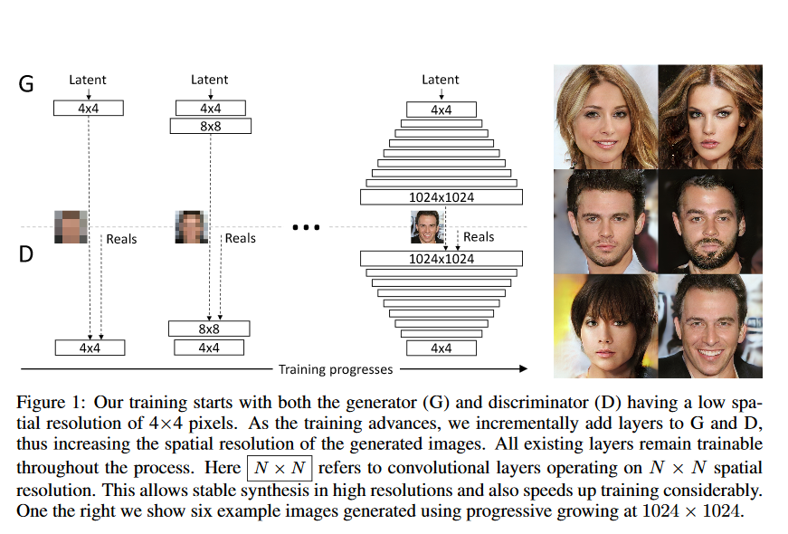
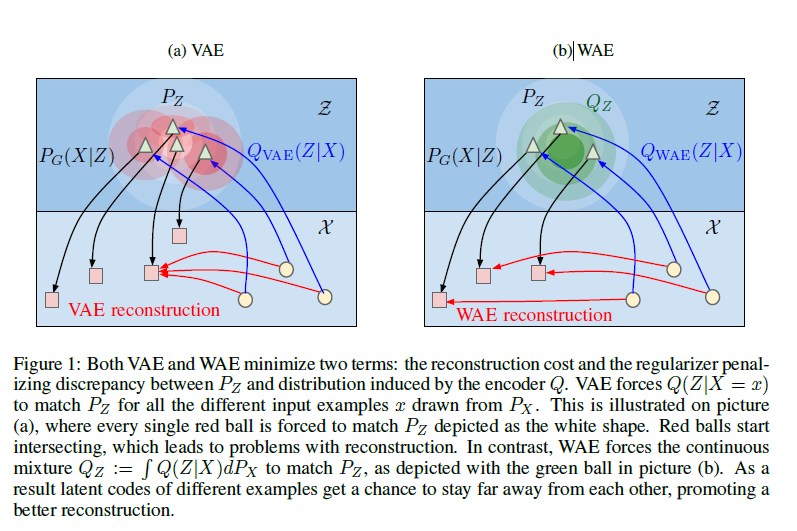
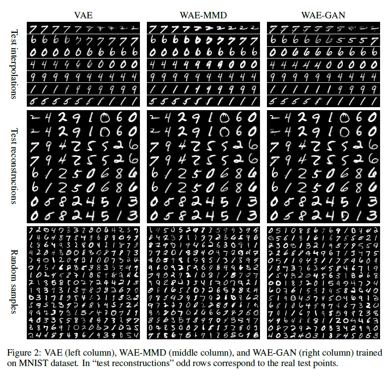
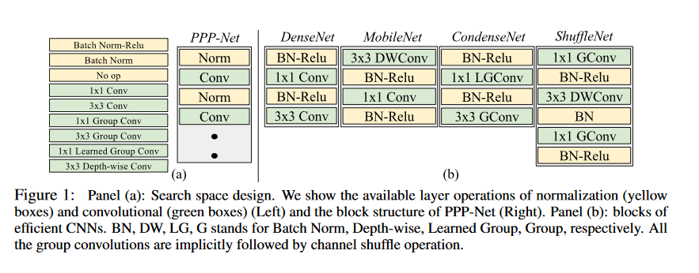
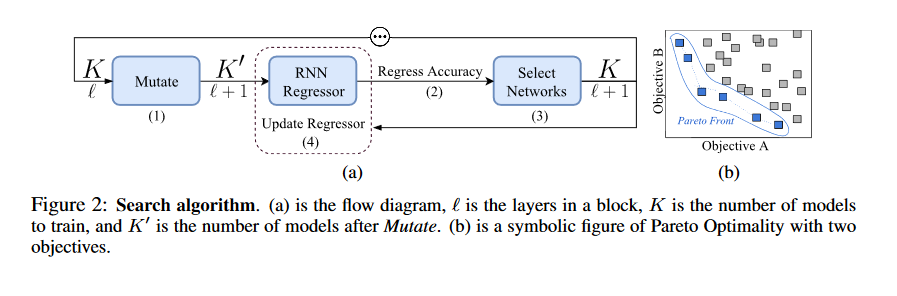
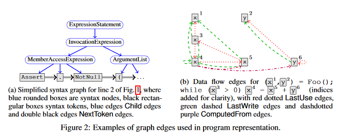
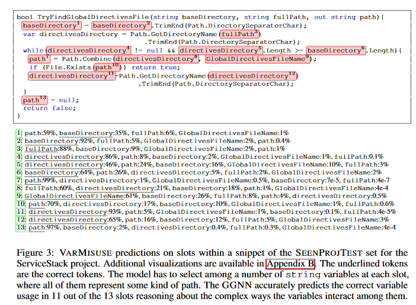
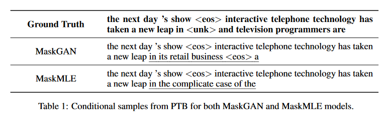
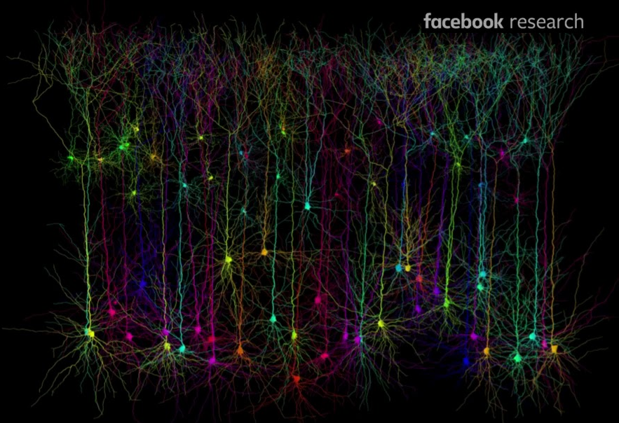

## AI research showcased at 
# International Conference on Learning Representations (ICLR) 2018

[Conference proceedings and open review](https://openreview.net/group?id=ICLR.cc/2018/Conference)

### Summary

#### Generative adversarial network (GAN)
* Common usecase: generate photo realistic images e.g., road pictures at different lighting
* Research problems
    * Mode collapse: 
    * Zero-shot learning

#### Reinforcement learning
* Common usecase: 
    * Training of machine learning model using real-time feedback 
    * E.g., AlphaGo
* Research problems
    * Policy gradient
    
#### Graph-based Neural Network
* Common usecase: 
    * Find bugs in software code repositories

#### Sequence model: MACnets
* Common usecase: 
    * Language translation, Question and answer
* Research problems
    * Reasoning
    * E.g., What is name of the building that is by the eight ave, left to Holt Renfrew and next to Banker's hall? Eighth avenue place.

## Keynote 1: What Can Machine Learning Do? Workforce Implications
Erik Brynjolfsson  
MIT  

[URL](https://openreview.net/forum?id=B1QRgziT-)

* Economist's perspective of AI 
    * Average person's life did not much until 1775 (Steam engine)
    * Steam engine is a general purose technology

    * AI is a general purpose technology
        * Pervasive
        * Improve over time
        * Complementary innovation  
    
** "Our job is to solve intelligence and then use that to solve problems of the world", Demis Hassabis, DeepMind**

* Backlash against technology
* Challenges
    * Income distribution
    * Job loss
    * False news
    * Bias
    
** There is no shortage of work that only humans can do **

* Additional considerations:  
    * No economic law that most people will benefit
    * Median family income remains flat
    * Corporate profit does not distribute to labours
    * There are more millionairs and billionairs (1%)

* Suitable for Machine learning (SML) tasks
    * Experiment to detemine which tasks are suitable for machines
    * Machine learning is not good at developing treatment plans as done by Radiologists
    * SML score is not correlated with Wage
    
* To Dos:  
    * Design parameters/policies 
    * Reinvent future of work
    * Invent technology to augment human instead of replacing human
    * Techonology does not decide how income distribution is done; humans do

## Keynote 2: Augmenting Clinical Intellgence with Machine Intelligence  
Suchi Saria  
John Hopkins University  

* Machine learning can improve accuracy of clinical decisions
* Diverse data source
    * Discrete Events Laboratories
    * Continuous physiologic measurements

* Computational diagnostics for Parkinsons
    * Determine the right dose of medication
    * Objectively quantify patients condition
    * Developed Android app to use cell phone sensors
    
    * Machine learning: Input are the cell phone's sensor's data 
      and output is the severity of the disease
    * Max margin comparision between before medication and after medication test
    * Semi-supervised learning to learn cheaply

* Early diagnosis and prevention
    * Forecasting the risk of a patient to be hospitalized in the short term future
    * Analyze Sparse and irregular time series
    * Segment time series - Sliding window approach
        * Supervised learning 
        * Policy changes 
        * Control the changes in the future (NIPS paper) 
        * Incorporate counter factor and confounder
        * Control regime where something might changes between sliding window and the risk assessment period.        

### Progressive Growing of GANs for Improved Quality, Stability, and Variation
Tero Karras, Timo Aila, Samuli Laine, Jaakko Lehtinen  
NVIDIA  

* Training GAN
    * GAN for high resolution
    * Start with small resolution
    * As we are close to goal, increase the resolution

    * Resemble multilayer auto-encoder training 
* Normalization 
    * D - nothing
    * G - Pixel normalization
    
* Dataset - LSUN
* Sliced Wasserstein distance is used

## Wasserstein auto-encoders (WAE)
Ilya Tolstikhin, Olivier Bousquet, Sylvain Gelly and Bernhard Schoelkopf  
[URL](https://iclr.cc/Conferences/2018/Schedule?showEvent=369)

* Generative adversarial networks (GANs) (Goodfellow et al., 2014) have been very popular to generate high quality images
    * However, GAN comes without an auto-encoder as it is desirable to reconstruct the latent codes and use the learned manifold
    * GAN is harder to train 
    * GAN suffers from the "mode collapses" where the resulting model is unable to capture all the variability in the true data distribution

* Variational auto-encoder (VAE), on the other hand, contains a good theoretical foundation for a generative model while providing a learned representation of the input
    * However, VAE does not generate good quality images
    
* Wasserstein auto-encoder (WAE) blends the adversarial training of GANs with autoencoder architectures
* WAE approach generative modeling from the optimal transport (OT) point of view. The OT cost (Villani, 2003) is a way to measure a distance between probability distributions
* Objective of WAE has two terms: 
    1. Reconstruction cost
        * It ensures that latent codes provided to the decoder are informative enough to reconstruct the encoded training examples
    1. Regularizer $D_{Z}(P_{Z};Q_{Z})$ 
        * It penalizes a discrepancy between two distributions in $Z$ and $P_{Z}$ and a distribution of encoded data points, i.e. $Q_{Z} := E_{P_{X}}[Q(Z|X)]$
        * It captures how distinct the image by the encoder of each training example is from the prior $P_{Z}$

* Two different regularizers have been proposed
    * WAE-GAN: is based on GANs and adversarial training in the latent space Z. 
    * WAE-MMD: uses the maximum mean discrepancy which is known to perform well when matching high-dimensional standard normal distributions $P_{Z}$ (Gretton et al., 2012).

  

## PPP-NET:  PLATFORM-AWARE PROGRESSIVE SEARCH FOR PARETO-OPTIMAL NEURAL ARCHITECTURES 
Jin-Dong Dong, An-Chieh Cheng, Da-Cheng Juan, Wei Wei& Min Sun

Proposal:  
* Find out optimal Neural network architecture using Pareto optimization
* Optimization objectives - accuracy and computational cost
    
Methodology:  
* Start with best know network configurations - DenseNet, SparseNet

* Mutate: Add layers from the search space

* RNN Regressor
    * Input: architecture and previous layer's accuracy
    * Infer network's true accuracy given its architechture
* Select K networks using Pareto Optimality

* Update regressor
     * Train the selected K networks each for N epochs
     * Use the evaluation accuracies (output) and the architectures (inputs) to update the RNN regressor

* Performance of each layer is feed to a RNN Regressor as well as each model settings is fed to the regressor as embedding

## Learning to represent program using Graphs
Miltiadis Allamanis, Marc Brockschmidt, Mahmoud Khademi  
Microsoft Research  

Proposal  
* Graphs to represent both syntactic and semantic structure of code
* Apply Deep Neural Network to reason over the graph 
* Applications  
    * Variable Misuse identifying
    * Generate proper variable names  
    * Find bug  
    
* Learning to Reason about Code
    * Control flow
        * Last use, write and computed from
    * Data flow

* Graph Neural Network

    * Based on Gate Graph Neural Networks
    * Program graph uses Abstract Syntax Tree (AST)
    * Additional edges are added to capture control and data flow
    * Use word embedding for tokens

## MASKGAN: BETTER TEXT GENERATION VIA FILLING IN THE ______
William Fedus, Ian Goodfellow and Andrew M. Dai  
Google Brain  

* Propose to use Generative Adversarial Network to fill missing text in a paragraph
* Current seq-2-seq model from applies 
    * Maximum likelihood based training
    * Optimize perplexity
    * Results in poor quality when generating samples conditioned on new words not seen during training  
    
* Proposed MaskGAN  

    * Actor-critic GAN provides rewards at every time step
    * Generate better samples 
    * Mode collapse problem is shown by reduced number of quadgrams
    * Quality of the generated samples remain consistent despite mode collapse
    * Authors claim mode collapse occure near the end of the sequence.

## Deep Learning with Ensembles of Neocortical Microcircuits
Blake Richards  

* Deep learning has shown that learning hierarchical representation in the data is useful
* Effective hierarchical learning depends on credit assignment which is the method of determining which neurons
    and synapses in the hierarchy are ultimately responsible for behaviors. 
* Backpropagation does not align with how our brain works
* Author proposed a computational model for hierarchical credit assignment inspired by neocortical microcircuits.   

* Details of how neuron works in our brain

    * Pyramidal structure of neuron plays a key role
    * Ensemble of pyramidal neurons
    * Fully Connected Network
    * Multiplex top-down and up-down signals from dendrites
    
* t-SNE on the representation of network of dendrites
* Each unit is a group of neurons instead of one neuron
    * Each burst may be related to burst of more than one neuron 
* Neurons that are derived from the same progenitor cells have similar connections and
    are much more likely to be connedvted each other

